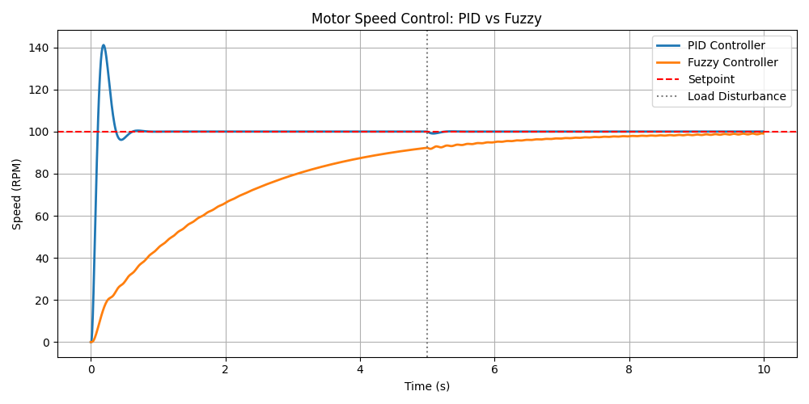

# DC Motor Speed Control: Fuzzy Logic vs. Conventional PID

This repository contains the mathematical modeling, simulation, and comparative performance analysis of a Conventional PID controller and a Fuzzy Logic controller applied to the closed-loop speed control of a Direct Current (DC) motor subjected to external load disturbances.

## Overview

The objective of this project is to evaluate the behavior of linear (PID) and non-linear heuristic (Fuzzy) control strategies when regulating the angular speed of a second-order dynamic plant. The system tracks a target reference speed (setpoint) and must recover from sudden mechanical load variations while preserving actuator integrity.

## Repository Structure

```text
fuzzy-vs-pid-motor-control/
├── docs/                   # Assignment instructions, reports, and diagrams
├── results/                # Output simulation plots and performance data
├── src/                    # Source code directory
│   ├── controller_fuzzy.py # Mamdani Fuzzy inference system implementation
│   ├── controller_pid.py   # Discrete PID controller with Anti-Windup logic
│   ├── motor_plant.py      # Numerical model of the DC motor dynamics
│   └── simulate.py         # Main entry point to execute the simulation loop
├── .gitignore              # Git ignored files configuration
├── LICENSE                 # Repository license
├── README.md               # Project documentation
└── requirements.txt        # Python dependencies
```

## Control Strategies and System Architecture

### 1. DC Motor Plant (`motor_plant.py`)
The physical plant is modeled as a second-order system governed by coupled differential equations representing the armature electrical circuit and the rotor mechanical dynamics. State updates are computed using the Euler numerical integration method at a fixed time step (`dt = 0.01s`). Driver saturation limits are set to standard industrial bounds (-24V to +24V).

### 2. Conventional PID Controller (`controller_pid.py`)
A discrete Proportional-Integral-Derivative controller tuned for fast response times. It incorporates native **Anti-Windup** clamping logic to halt integral accumulation when the control output saturates the actuator limits, ensuring a valid and fair baseline comparison.

### 3. Fuzzy Logic Controller (`controller_fuzzy.py`)
A non-linear Proportional-Derivative (PD-like) Fuzzy controller built with `scikit-fuzzy`.
* **Inference System:** Mamdani.
* **Antecedents (Inputs):** Speed Error (`error`) and Derivative of Error (`delta_error`), mapped across 5 linguistic terms (NB, NS, ZE, PS, PB).
* **Consequent (Output):** Voltage increment applied to the motor armature (`voltage_change`).
* **Defuzzification:** Centroid (Center of Gravity) method.

## Simulation Setup and Comparative Results

The standard testbench applies a unit step target of **100 RPM** at `t = 0s`. At `t = 5s`, an external load torque disturbance is injected directly into the motor shaft to evaluate disturbance rejection capabilities.



### Performance Metrics Summary

| Metric | Conventional PID | Fuzzy Logic Controller |
| :--- | :---: | :---: |
| **Rise Time** | **< 0.2s** (Extremely fast) | **~5.0s** (Smooth/Damped) |
| **Overshoot** | **~41%** (Critical stress) | **0%** (Zero overshoot) |
| **Steady-State Error** | 0% | 0% |
| **Disturbance Rejection** | Instantaneous recovery | Smooth adaptive recovery |
| **Hardware Impact** | High initial current spikes | Safe operational profile |

### Key Findings
* The **PID controller** provides an exceptionally fast rise time but introduces a 41% overshoot. In physical applications, this behavior induces severe mechanical torsion on the rotor shaft and demands high peak inrush currents from the power supply.
* The **Fuzzy controller** demonstrates an overdamped response profile. By trading initial speed for stability, it achieves **zero overshoot**, eliminating mechanical stress and electrical current spikes. Both controllers successfully handle steady-state error and reject external load disturbances.

## Getting Started

### Prerequisites
Ensure you have Python 3.10+ installed. The project relies on standard scientific computing libraries.

### Installation

1. Clone this repository:
   ```bash
   git clone [https://github.com/YOUR-USERNAME/fuzzy-vs-pid-motor-control.git](https://github.com/YOUR-USERNAME/fuzzy-vs-pid-motor-control.git)
   cd fuzzy-vs-pid-motor-control
   ```

2. Create and activate a virtual environment (recommended):
   ```bash
   python -m venv .venv
   # On Windows:
   .venv\Scripts\activate
   # On Linux/macOS:
   source .venv/bin/activate
   ```

3. Install the required dependencies:
   ```bash
   pip install -r requirements.txt
   ```

### Running the Simulation

Navigate to the source directory and execute the simulation script:

```bash
cd src
python simulate.py
```

Upon successful execution, the console will confirm completion and the generated comparative chart will be saved automatically to `results/comparison.png`.

## License

This project is licensed under the MIT License - see the [LICENSE](LICENSE) file for details.